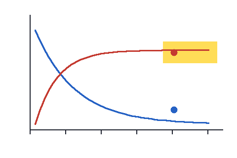

Everything in this file is invented. It is written with the AXOM markers and built into a Word file by pandoc, so the reader is tested on Word numbering, merged cells and Word equations that a real producer wrote.

QUESTION 1

[AXOM META]

Course: EXAMPLE

Term: 1

Week: 1

Discipline: Example

[STEM]

A volunteer's Na^+^ and HCO~3~^−^ are measured. The half-life is $t_{1/2}$ and **not** the clearance.

[TABLE]

+-----------+-----------------------+
| Test      | Result                |
+===========+===========+===========+
| Marker A  | 12.0      | mg/dL     |
+-----------+-----------+-----------+
| Marker B  | 0.2 μU/mL             |
+-----------+-----------------------+

[IMAGE]

{width=3in}

[IMAGE: answer reveal]

{width=3in}

[STEM CONTINUED]

$$RR = \frac{40/200}{30/300} = 2.0$$

Which value is the relative risk?

[CHOICES]

A.  0.5
B.  **2.0**
C.  4.0 ↑

[ANSWER]

B

[EXPLANATION]

The risk is 0.2 in one group and 0.1 in the other, so $\sqrt{4} = 2$ times.

[SOURCE]

File: invented.pdf

Pages: 2-3

[END QUESTION]

QUESTION 2

[STEM]

Which row shows the pattern that follows?

[CHOICES]

[TABLE]

+---+------------------+---------------+
|   | Pituitary signal | Gland hormone |
+===+==================+===============+
| A | ↑                | ↑             |
+---+------------------+---------------+
| B | ↑                | ↓             |
+---+------------------+---------------+
| C | ↓                | ↑             |
+---+------------------+---------------+

[ANSWER]

B

[END QUESTION]
