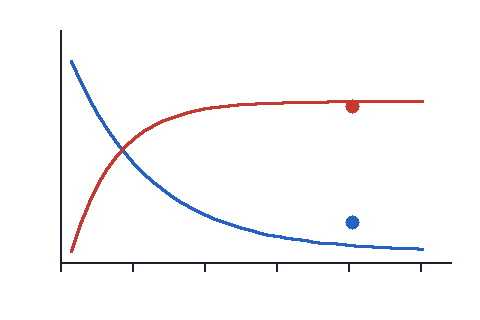

Invented practice questions

Everything in this file is invented. It has no AXOM markers, so it is read by the text parser with its table and picture carried through.

1.  An infusion of an invented compound is stopped and its plasma level is measured.

+-------------------------+----------------------+
| Time after infusion (h) | Plasma level (μg/mL) |
+=========================+======================+
| 0                       | 16                   |
+-------------------------+----------------------+
| 2                       | 8                    |
+-------------------------+----------------------+
| 4                       | 4                    |
+-------------------------+----------------------+

What is the half-life of the compound?

A.  1 h
B.  2 h
C.  4 h
D.  6 h

Answer: B

Explanation: The level halves every 2 h.

2.  The graph shows the plasma level of two invented compounds after one dose.

{width=3in}

Which statement about the red compound is supported by the graph?

A.  Its level falls by half every hour
B.  Its level rises to a plateau
C.  It is never detected
D.  Its level is always lower

Answer: B
